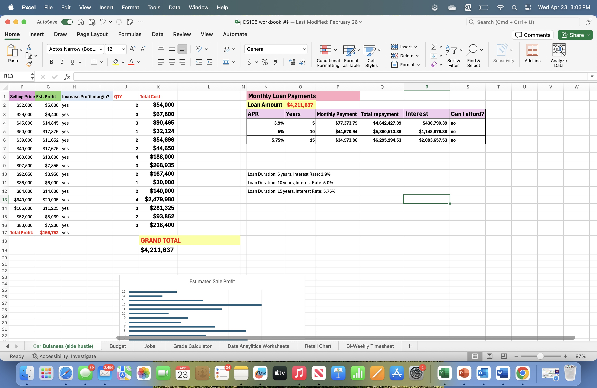
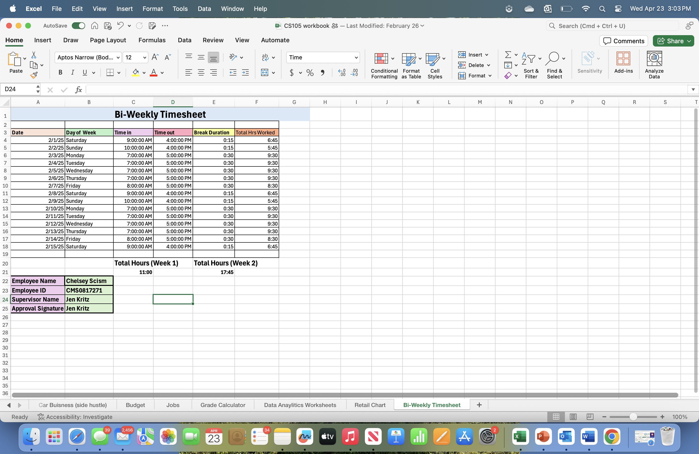
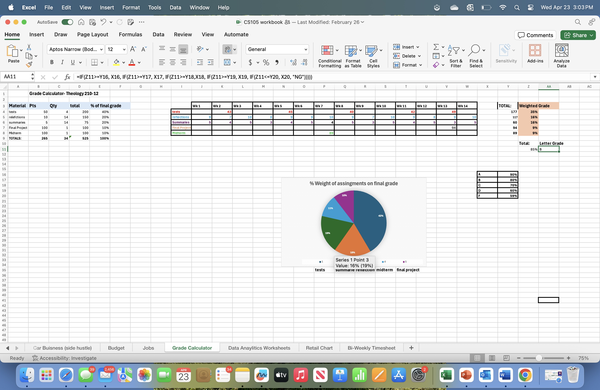

# Chelsey Scism
Contact Info: cmscism@loyola.edu 
### About Me 
Hello! I am an experienced Server and Food Industry professional with over 5 years of proven expertise in the Industry. 

With skills in customer service , organization , people management, and time management, I am able to work with all kinds of people. I am adept at using Microsoft Excel, Python, and GitHub. 

My diverse skill set, commitment to work/service, and passion for learning me as a valuable asset.  In my spare time, I like to paint and workout. 

You can find me on Facebook or Instagram as Chelsey Scism. 

### Education 
Political Science Major at the Loyola University of Maryland 
***
### Projects

#### Side Hustle - Car Buisness 

**Summary:**
This project was meant to estimate a monthly profit and cost margin for my car business. The goal was to find the grand total cost with loans included. I was able to do this through Microsoft Excel using formulas. 

**Initial project idea:** 
This project was used to estimate a profit margin for my car business side hustle. 

**Tools I used:** 
I used Microsoft Excel for this project and formulas/ commands for my results. 

**Challenges I faced:**
I faced challenges with how to get my results. I overcame this by using different formulas until I was correct. 

**Other Resources:**
I used recourses posted for my course to complete this assignment. 
Result:
I liked the results of this assignment. My goal was to find my profit margin which was achieved. 

***
#### Bi-Weekly Timesheet 
 Initial project idea: 
This project was meant to track the hours I worked on a bi- weekly basis. 

Tools I used: 
I used Microsoft Excel formulas and desktop to complete this assignment. 
Challenges I faced:
Challenges I faced was getting my excel boxes into time form. After trying a few different ways I was able to figure it out. 

Other Resources: 
Class time was used for help with this assignment. As well as recourses on our course page. 

Result:
I set out to calculate how many hours I had worked; this was achieved. 

Summary:
I enjoyed using this to calculate my time worked over a two week period. This assignment can be used and changed for any bi-weekly working chart which is helpful. 
  

#### Grade Calculator 
 - Initial project idea: 
This assignment was used to estimate my final course grade using the course material and information. 
Tools I used: 
I used Microsoft Excel and pie chart to create this. 
Challenges I faced:
I faced challenges with calculating my letter grade through my weighted grade in percentage. I overcame this through Excel commands. 
Other Resources: 
I did not use other resources for this project. 
Result:
I set out to calculate my possible grade for a course. I achieved this by setting it up weekly and inserting my possible grades with outcomes. 
Summary:
This assignment was used to alulae grades for nay course. It is interchangeable for any course of there same length. This project used the weeks of the course, the assessments, the weight, and overall grade possibilities to achieve completion. 

